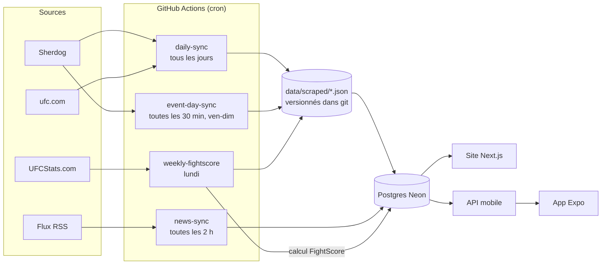

# MMA Universe

Une plateforme MMA en français qui agrège les cartes, les résultats, les combattants et l'actualité de 13 organisations, et qui publie son propre classement : le **FightScore**. C'est une note de combattant calculée chaque semaine à partir des statistiques réelles de chaque combat UFC, sans vote ni avis éditorial.

Le projet comprend un site Next.js, une app mobile Expo, un pipeline de scraping automatisé par GitHub Actions et un moteur de notation (Glicko + score de dominance + régression logistique), écrit en TypeScript de bout en bout et sans bibliothèque de ML.

---

## Sommaire

- [Fonctionnalités](#fonctionnalités)
- [Architecture](#architecture)
- [Sources de données](#sources-de-données)
- [Le pipeline](#le-pipeline)
- [Le FightScore](#le-fightscore)
- [Stack technique](#stack-technique)
- [Structure du dépôt](#structure-du-dépôt)
- [Lancer le projet](#lancer-le-projet)

---

## Fonctionnalités

| Page | Contenu |
| --- | --- |
| `/classement-calcule` | **FightScore** : classement calculé par catégorie et pound-for-pound, avec tendance hebdomadaire (▲ ▼ New) et page [méthodologie](app/classement-calcule/methodologie/page.tsx) |
| `/simulateur` | Simulateur de combat : probabilité de victoire entre deux combattants à partir de leurs notes et de leur incertitude |
| `/fighters/[slug]` | Fiche combattant : palmarès complet (y compris hors des organisations suivies), taille, allonge, âge, nationalité, FightScore, profil de style, probabilité de victoire |
| `/events` | Événements à venir et passés, cartes complètes, horaires de diffusion UFC |
| `/rankings` | Classements officiels UFC |
| `/actualites` | Actualités MMA agrégées par flux RSS (FR et EN) |
| `/mes-pronostics` | Pick'em : pronostics sur les combats, avec un compte utilisateur (Clerk) |
| `mobile/` | App iOS / Android (Expo Router) qui consomme les routes `app/api/mobile` |

## Architecture



Chaque scraper écrit d'abord un fichier JSON versionné dans `data/scraped/`, puis une étape de synchronisation séparée pousse ce fichier dans Postgres. Ce découpage a trois avantages :

- **Rejouable** : une synchro peut être relancée sans repasser par le réseau.
- **Auditable** : chaque rafraîchissement de données est un commit (`chore(scrape): daily data refresh`), donc l'historique git montre ce qui a changé et quand.
- **Reprenable** : les crawls longs (plusieurs heures pour l'historique complet) enregistrent un point de reprise dans `data/scraped/.cache/` et repartent de là s'ils sont interrompus.

## Sources de données

| Source | Données | Technique |
| --- | --- | --- |
| **Sherdog** | Événements, cartes et résultats de 13 organisations : UFC, PFL, Bellator, ONE, Cage Warriors, Rizin, KSW, ACA, Invicta, LFA, Hexagone, Ares, Oktagon. Historique complet de chaque combattant, taille, date de naissance, nationalité. | `axios` + `cheerio`, requêtes espacées ([fetch-throttled.ts](data/scrapers/shared/fetch-throttled.ts)) |
| **UFCStats.com** | Statistiques de chaque combat UFC, **round par round** : frappes significatives (tête/corps/jambes, distance/clinch/sol), takedowns, temps de contrôle, knockdowns, tentatives de soumission. Allonge, catégorie du combat, type de décision, bonus de la soirée. | Le site est protégé par un challenge anti-bot en JavaScript que l'on ne passe pas avec un simple client HTTP. On utilise donc **Playwright** (Chromium headless) avec un seul contexte navigateur réutilisé pendant tout le crawl ([fetch-playwright.ts](data/scrapers/shared/fetch-playwright.ts)). |
| **ufc.com** | Classements officiels (champions inclus), horaires de diffusion prelims / main card | `axios` + `cheerio` |
| **RSS** | Actualités : Sherdog, MMA Fighting, L'Équipe MMA | `rss-parser` ([sources.config.ts](data/news/sources.config.ts)) |

Les parseurs sont testés sur des pages HTML réelles enregistrées dans `__fixtures__/`, pour qu'un changement de structure côté source fasse échouer un test plutôt que de corrompre la base sans bruit.

## Le pipeline

| Workflow | Fréquence | Étapes |
| --- | --- | --- |
| [`daily-sync.yml`](.github/workflows/daily-sync.yml) | Tous les jours, 09:00 UTC | Re-scrape des événements à venir (13 orgs) → mise à jour de l'historique Sherdog des combattants des derniers combats → commit des JSON → synchro Neon → horaires de diffusion UFC → classements officiels UFC → historique et physique (taille, allonge, date de naissance) des nouveaux combattants |
| [`event-day-sync.yml`](.github/workflows/event-day-sync.yml) | Toutes les 30 min, vendredi à dimanche | Détecte les organisations qui ont un événement le jour même et ne re-scrape que celles-là, pour publier les résultats pendant la soirée |
| [`weekly-fightscore.yml`](.github/workflows/weekly-fightscore.yml) | Lundi, 12:00 UTC | Scrape UFCStats (stats + bonus) via Playwright → synchro Neon → **recalcul du FightScore** |
| [`news-sync.yml`](.github/workflows/news-sync.yml) | Toutes les 2 h | Ingestion des flux RSS |

Rapprocher les combattants entre sources est la partie difficile : Sherdog, UFCStats et ufc.com n'écrivent pas les noms de la même façon (accents, surnoms, translittérations). La correspondance se fait par normalisation de nom, limitée à l'organisation concernée ([ranking-name-match.ts](data/scrapers/ranking-name-match.ts)), et elle est testée.

## Le FightScore

Le FightScore classe les combattants UFC sur une échelle de 0 à 100 par catégorie, plus un classement pound-for-pound. Il est recalculé chaque lundi par [`compute-fighter-ratings.ts`](data/scripts/compute-fighter-ratings.ts). Le calcul se fait en quatre étapes.

### 1. Un score de dominance par victoire

[`dominance-score.ts`](data/lib/rating/dominance-score.ts) note chaque victoire entre 0 et 1 :

| Composante | Poids |
| --- | --- |
| Part des rounds gagnés | 0,35 |
| Bonus de finish (KO/TKO, soumission) | 0,30 |
| Écart de frappes significatives | 0,20 |
| Écart de temps de contrôle | 0,15 |

Le vainqueur de chaque round est **estimé** à partir des statistiques du round (`frappes sig. + 0,5 × minutes de contrôle + 5 × knockdowns`), car les cartes des juges ne sont pas publiées sous une forme exploitable. Les rounds gagnés pèsent autant que le finish : une décision où le vainqueur domine tous les rounds compte presque autant qu'un KO au premier round. Une version antérieure de la formule sous-évaluait ce type de victoire, ce que j'appelais le « problème Khabib ».

Deux ajustements volontairement modestes viennent ensuite : une décision partagée retire 0,10 et une décision majoritaire 0,05, tandis qu'un bonus Performance de la Nuit ajoute 0,10 et un Combat de la Nuit 0,05.

### 2. Une note Glicko unique sur toute la carrière

[`glicko-rating.ts`](data/lib/rating/glicko-rating.ts) et [`simulate-career.ts`](data/lib/rating/simulate-career.ts) rejouent toute l'histoire de l'UFC dans l'ordre chronologique :

- **Une seule note par combattant**, valable dans toutes les catégories. Un champion qui monte de catégorie garde sa note, avec une incertitude plus grande le temps de confirmer.
- **La force du calendrier est intégrée** : battre un adversaire bien noté rapporte beaucoup, battre un débutant presque rien. Enchaîner les combats faciles ne suffit pas pour monter.
- **La dominance module le gain**, mais une victoire serrée vaut toujours au moins 80 % d'une victoire nette (`winScoreFloor`). Ainsi, un combattant ne reste pas classé devant celui qui vient de le battre.
- **L'incertitude (RD) est prise en compte** : elle grandit avec l'inactivité et avec un changement de catégorie. Le classement utilise une note prudente (note − 2 × RD), si bien que trois victoires spectaculaires ne suffisent pas à dépasser dix ans de résultats.

Le score affiché ([`display-scores.ts`](data/lib/rating/display-scores.ts)) vaut **deux fois la probabilité estimée de battre le n°1** de la catégorie : le n°1 vaut 100, et un combattant qui a environ une chance sur quatre de le battre vaut à peu près 50. Le champion en titre est toujours affiché en première position (la ceinture est un fait sportif), et en pound-for-pound aucun challenger ne passe devant le champion de sa propre catégorie.

### 3. Un profil de style

[`style-archetype.ts`](data/lib/rating/style-archetype.ts) attribue à chaque combattant un style parmi les suivants : lutteur/contrôleur, spécialiste soumission, frappeur de distance, puncheur, clincheur/pression ou polyvalent. Le style est calculé à partir de ses taux par 15 minutes, avec un poids plus fort pour les combats récents, en comparaison avec les combattants actifs de sa catégorie. Un style n'est attribué que si le trait est à la fois nettement au-dessus de la catégorie et élevé dans l'absolu.

Une première version utilisait un k-means. Je l'ai remplacée parce que les clusters changeaient d'un recalcul à l'autre et que les étiquettes n'étaient pas fiables.

### 4. Une probabilité de victoire apprise

[`logistic-regression.ts`](data/lib/rating/logistic-regression.ts) est une régression logistique écrite à la main (descente de gradient, normalisation des features), entraînée par [`train-win-predictor.ts`](data/scripts/train-win-predictor.ts) sur 15 écarts entre les deux combattants : score de carrière, série en cours, statut d'ancien champion, inactivité, dominance moyenne sur les 3 derniers combats, et style sur les 5 derniers (frappes par zone, takedowns, contrôle, soumissions). Les poids sont exportés dans [`data/ml-models/win-predictor.json`](data/ml-models/win-predictor.json).

### Validation

Les paramètres sont choisis sur les combats antérieurs à mars 2023, puis évalués sur les **1 468 combats suivants**, que le modèle n'a jamais vus ([`tune-glicko.ts`](data/scripts/tune-glicko.ts), [`glicko-params.json`](data/ml-models/glicko-params.json)) :

| Prédicteur | Précision sur le jeu de test |
| --- | --- |
| Hasard | 50 % |
| Note de carrière seule | ~57 % |
| Régression logistique | ~58 % |

Ces chiffres restent modestes, et c'est attendu : un combat de MMA est très incertain, et les meilleurs modèles publics se situent dans les mêmes eaux. La page méthodologie le dit clairement aux visiteurs.

En plus de cette validation, [`sanity-checks.ts`](data/lib/rating/sanity-checks.ts) contrôle à chaque calcul que le classement reste cohérent, par exemple qu'aucun n°1 de catégorie n'a seulement une poignée de combats et aucune victoire contre le top 10. Ces contrôles ne forcent jamais un nom à une position donnée.

## Stack technique

- **Web** : Next.js 14 (App Router, Server Components), React 18, Tailwind CSS
- **Mobile** : Expo 54, React Native, Expo Router, NativeWind
- **Données** : Postgres serverless sur Neon (`@neondatabase/serverless`)
- **Auth** : Clerk
- **Scraping** : axios, cheerio, Playwright, rss-parser
- **Notation / ML** : TypeScript pur (Glicko, régression logistique, simulations), sans dépendance externe
- **CI / ordonnancement** : GitHub Actions
- **Tests** : `node:test` via `tsx` (`*.test.ts` dans `data/`)

## Structure du dépôt

```
app/                    Pages Next.js + routes API (web, mobile, cron)
components/             Composants React
mobile/                 App Expo (iOS / Android)
data/
  scrapers/             Scrapers Sherdog, UFCStats, ufc.com + synchros vers Neon
    shared/             Fetch (throttle / Playwright), checkpoints, normalisation
    __fixtures__/       Pages HTML réelles pour les tests de parsing
  scraped/              Données brutes scrapées (JSON versionnés)
  lib/rating/           Moteur FightScore : dominance, Glicko, scores, styles, régression
  scripts/              Calcul, calibrage, réglage et entraînement du FightScore
  ml-models/            Paramètres réglés et poids du modèle entraîné
  news/                 Ingestion RSS
docs/superpowers/       Specs de conception et plans d'implémentation de chaque fonctionnalité
.github/workflows/      Pipelines planifiés
```

Chaque fonctionnalité importante a d'abord fait l'objet d'une spec et d'un plan écrits dans [`docs/superpowers/`](docs/superpowers/), avant la moindre ligne de code. Par exemple : [conception du FightScore](docs/superpowers/specs/2026-09-14-fighter-rating-algorithm-design.md), [passage à Glicko](docs/superpowers/specs/2026-09-22-fightscore-glicko-design.md).

## Lancer le projet

Prérequis : Node 20 et une base Postgres (Neon).

```bash
npm install
```

Créer un fichier `.env.local` :

```
DATABASE_URL=postgres://...
NEXT_PUBLIC_CLERK_PUBLISHABLE_KEY=...
CLERK_SECRET_KEY=...
NEXT_PUBLIC_CLERK_SIGN_IN_URL=/sign-in
NEXT_PUBLIC_CLERK_SIGN_UP_URL=/sign-up
```

```bash
npm run dev
```

Commandes utiles :

| Commande | Rôle |
| --- | --- |
| `npm test` | Lance tous les tests unitaires |
| `npm run scrape:ufc` (ou `scrape:all`) | Scrape une organisation (ou toutes) depuis Sherdog |
| `npm run scrape:ufcstats` | Scrape les stats round par round depuis UFCStats (nécessite `npx playwright install chromium`) |
| `npm run sync:fighter-stats` | Pousse les stats UFCStats dans Neon |
| `npm run compute:ratings` | Recalcule le FightScore |
| `npm run tune:glicko` | Règle les paramètres Glicko (entraînement / test temporel) |
| `npm run train:win-predictor` | Entraîne la régression logistique |
| `npm run check:ratings` | Lance les contrôles de cohérence sur le classement |

---

Les données proviennent de sources publiques (Sherdog, UFCStats.com, ufc.com) et sont récupérées avec des requêtes espacées. Ce projet n'est affilié à aucune organisation de MMA.
